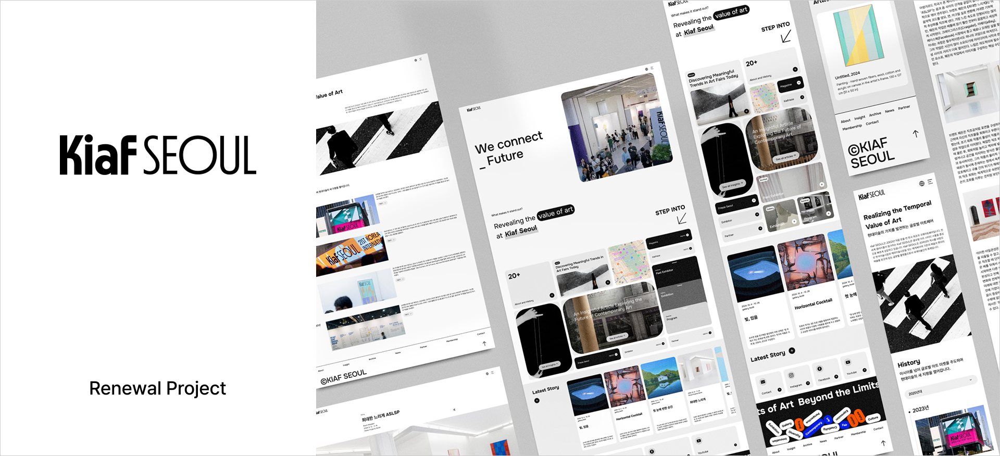
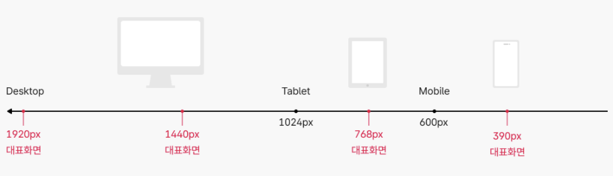
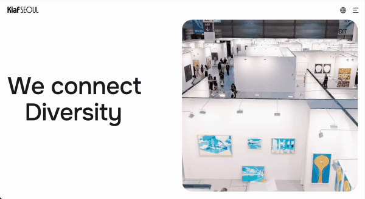
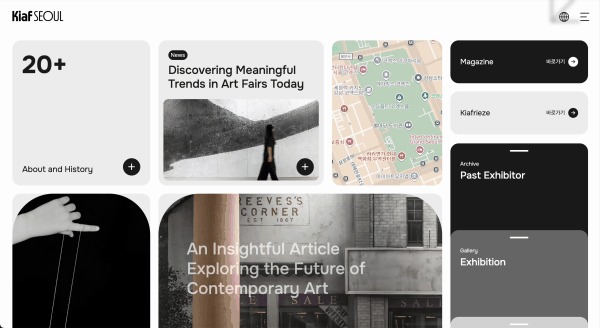

# Kiaf SEOUL - Website Renewal

## 📌 프로젝트 소개

**국제아트페어 'Kiaf SEOUL' 웹사이트를 리디자인한 프로젝트입니다.**  
기존 사이트의 구조를 참고하여, 정보 전달 중심의 단순한 레이아웃을 보다 감각적이고 브랜드 아이덴티티에 맞게 재구성했습니다.

## 🔍 주요 기능 및 특징

- GSAP과 Lenis를 활용한 부드러운 애니메이션과 스크롤 경험
- Swiper를 활용한 콘텐츠 슬라이드로 직관적인 탐색 UX 제공
- Matter.js 기반 키워드 애니메이션으로 브랜드 메시지를 직관적이고 감각적으로 표현
- 모바일, 태블릿, 데스크탑에 최적화된 반응형 웹 구현

## 🖥 반응형 웹

> 대표 해상도는 1920px, 1440px, 768px, 390px 입니다.

## 🛠️ 기술 스택

### 디자인

### 프론트엔드

## 📄 페이지 구성

총 3개의 정적인 페이지로 구성되어 있으며, GitHub Pages를 통해 배포하였습니다.

- 메인페이지 : [Main](https://seeo00.github.io/kiafseoul/pages/)
- 서브페이지1 : [About](https://seeo00.github.io/kiafseoul/pages/about.html)
- 서브페이지2 : [Story](https://seeo00.github.io/kiafseoul/pages/story.html)

## 📽 주요 인터랙션

### ☑️ 인트로 타이핑 애니메이션

### ☑️ 스크롤 인터랙션 (1)

### ☑️ 스크롤 인터랙션 (2)

---

💬 짧은 분량이지만 애니메이션과 인터랙션을 통해 브랜드와 사용자의 연결을 시도했고, 간결한 구조 속에서 다양한 라이브러리를 경험할 수 있었던 프로젝트입니다.
